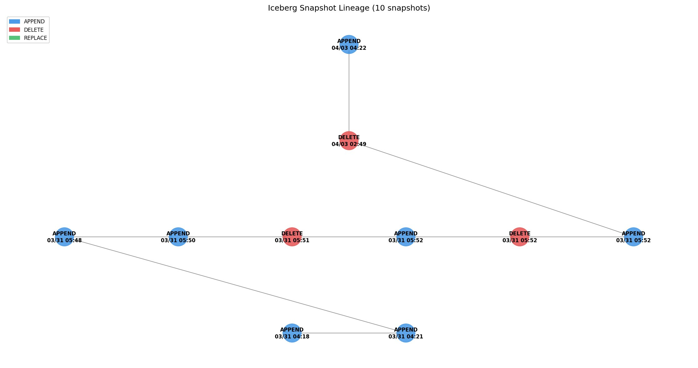

# iceberg-navigator

A CLI tool to inspect and diagnose Apache Iceberg snapshot histories on AWS.  
It uses PyIceberg with AWS Glue REST Catalog to list, compare, visualize, and detect anomalies in Iceberg tables stored on S3.

---

## Overview

Apache Iceberg manages table versions via snapshots, enabling powerful data management and governance.  
This tool allows you to quickly explore Iceberg snapshot histories from the command line — tracing parent-child relationships, detecting anomalies, tracking schema changes, and pinpointing the state of a table at any point in time.

---

## Features

| Command | Description |
|---|---|
| `list` | List all snapshots with record change tracking |
| `show` | Show detailed information for a specific snapshot |
| `compare` | Compare a snapshot with its parent (record count diff) |
| `diagnose` | Show a timeline of operations and flag anomalies |
| `schema-history` | Show all schema changes across metadata versions |
| `schema-diff` | Show before/after schema diff for a specific schema version |
| `find-snapshot` | Find the snapshot that was current at a given datetime |
| `graph` | Visualize snapshot lineage as a DAG (PNG output) |

---

## Requirements

- Python 3.8+
- Iceberg tables accessible via AWS Glue REST Catalog
- AWS credentials configured via environment variables or AWS CLI profiles

---

## Installation

```bash
git clone https://github.com/dataPenginPenguin/iceberg_navigator.git
cd iceberg_navigator
pip install -e .
```

After installation, the `iceberg-navigator` command becomes available.

---

## Commands

### list

List all snapshots with record count and change rate per snapshot.  
Use `--threshold` to flag rows where the record count changes by more than the specified percentage.

```bash
iceberg-navigator list --table <database>.<table>
iceberg-navigator list --table <database>.<table> --threshold 50
```

**Example output:**

```
|    | Snapshot ID         | Timestamp            | Operation | Parent Snapshot ID   | Total Size (MB) | Record Count | Change (%) |
|----|---------------------|----------------------|-----------|----------------------|-----------------|--------------|------------|
|    | 1533347322559466931 | 2025-05-22T02:10:24Z | APPEND    | null                 |           13.48 |      729,732 |          - |
|    | 1485371543345582290 | 2025-05-22T02:10:54Z | DELETE    | 1533347322559466931  |            0.00 |            0 |    -100.0% |
|    | 6216935665394419954 | 2025-05-22T02:41:54Z | APPEND    | 6369576239134108166  |           26.96 |    1,459,464 |    +100.0% |
```

---

### show

Show detailed information for a specific snapshot, including schema and summary statistics.

```bash
iceberg-navigator show <snapshot_id> --table <database>.<table>
```

**Example output:**

```
Table: yellow_tripdata

Snapshot ID: 7175588823669132362
Timestamp: 2026-03-06T02:27:10Z
Operation: Operation.DELETE
Parent Snapshot ID: 602174264357872961
Manifest List: s3://<your-bucket>/warehouse/yellow_tripdata/metadata/snap-....avro

Schema:
  1: vendorid: optional int
  2: tpep_pickup_datetime: optional timestamp
  ...

Summary:
  total-records: 0
  total-data-files: 0
  total-files-size: 0
```

---

### compare

Compare a snapshot with its parent and show the difference in record count and file size.

```bash
iceberg-navigator compare <snapshot_id> --table <database>.<table>
```

**Example output:**

```
----------------------------------------
Parent Snapshot
----------------------------------------
ID:         602174264357872961
File Size:  13.42 MB
Records:    729,732

----------------------------------------
Current Snapshot
----------------------------------------
ID:         7175588823669132362
File Size:  0.00 MB
Records:    0

========================================
Summary
========================================
Added Records:   0
Deleted Records: 729,732
```

---

### diagnose

Show a full timeline of snapshots and flag anomalies where record count changes exceed the threshold.  
Anomalies are summarized at the end with a suggested `compare` command for each.

```bash
iceberg-navigator diagnose --table <database>.<table> --threshold 50
```

**Example output:**

```
Anomaly threshold: ±50% record change

  2026-01-02T09:44:22Z  APPEND  records:    1,459,464  change:  +100.0%  [8362052512120533476]
⚠ 2026-01-02T14:34:44Z  APPEND  records:   10,445,650  change: +1331.4%  [8477810866715341247]

============================================================
⚠  1 anomaly(ies) detected (threshold: ±50%)
============================================================
  2026-01-02T14:34:44Z  APPEND  +1331.4%  [8477810866715341247]
  → Run: iceberg-navigator compare 8477810866715341247 --table <db.table>
```

---

### schema-history

Scan all metadata.json versions and show only the snapshots where schema changes occurred.

```bash
iceberg-navigator schema-history --table <database>.<table>
```

**Example output:**

```
5 schema change(s) detected:
============================================================
Schema ID   : 0 -> 1
Timestamp   : 2026-06-12T09:38:24Z
  Added columns:
    + new_col: int
  -> Run: iceberg-navigator schema-diff 1 --table icebergdb.flights_1m
============================================================
Schema ID   : 3 -> 4
Timestamp   : 2026-06-12T10:01:56Z
  Removed columns:
    - test_col: string
  -> Run: iceberg-navigator schema-diff 4 --table icebergdb.flights_1m
```

---

### schema-diff

Show the full before/after schema comparison for a given schema version.  
Use the `schema_id` shown in the `schema-history` output.

```bash
iceberg-navigator schema-diff <schema_id> --table <database>.<table>
```

**Example output:**

```
Schema diff: schema_id 3 -> 4

  Column         Before                After                 Change
  -----------------------------------------------------------------
  fl_date        date                  date
  dep_delay      int                   int
  arr_delay      int                   int
  air_time       int                   int
  distance       int                   int
  dep_time       double                double
  arr_time       double                double
  new_col        int                   int
  test_col       string                -                     - REMOVED
  status         string                string
```

---

### find-snapshot

Find the snapshot that was current at a given datetime.  
Useful for investigating the state of a table at the time of an incident.

```bash
iceberg-navigator find-snapshot --table <database>.<table> --at "2026-01-02T14:00:00+00:00"
```

**Example output:**

```
Snapshot at 2026-01-02T14:00:00+00:00:
Table: yellow_tripdata
Snapshot ID: 8362052512120533476
Timestamp: 2026-01-02T09:44:22Z
Operation: Operation.APPEND
...
```

---

### graph

Visualize snapshot lineage as a directed acyclic graph (DAG) and save as PNG.  
Use `--limit` to show only the latest N snapshots (recommended for large tables).

```bash
iceberg-navigator graph --table <database>.<table>
iceberg-navigator graph --table <database>.<table> --limit 10 --output graph_recent.png
```

Node colors:
- **Blue**: APPEND
- **Red**: DELETE
- **Green**: REPLACE

With `--limit 10` (recommended for large tables):



For reference, the full graph of a table with 316 snapshots:


> For large tables, `--limit` is strongly recommended. The full graph above shows the structure is still readable, but labels become too small to read.

---

## Notes

- `schema-history` and `schema-diff` detect schema changes that go through Iceberg's schema evolution (e.g. `ALTER TABLE` via Athena or Spark). Changes made directly to the Glue Data Catalog are not reflected in Iceberg metadata and should be tracked with `aws glue get-table-versions` instead.
- Glue Data Catalog has service quotas on the number of table versions. See [AWS Glue endpoints and quotas](https://docs.aws.amazon.com/general/latest/gr/glue.html) for details.

---

## License

MIT
